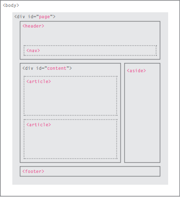

# HTML & CSS

## Structure

HTML describes the structure of pages by using elemnts to describe it, and we can use attributes to give the element more details.

## Extra Markup

Comments in HTML

* `<!-- your comment here -->`

ID Attribute

* `
text here
`

Class Attribute

* `
text here
`

DOCTYPES tell browsers which version of HTML you
are using.

## HTML5 Layout

* Older browsers that do not understand HTML5
elements need to be told which elements are
block-level elements
* To make HTML5 elements work in Internet Explorer 8
(and older versions of IE), extra JavaScript is needed,
which is available free from Google.

## Process & Design

Every website should be designed for the
target audience—not just for yourself or the
site owner. It is therefore very important to
understand who your target audience is.

### Example Site Map

### WIREFRAMES

* A wireframe is a simple sketch of the key
information that needs to go on each page of a
site. It shows the hierarchy of the information
and how much space it might require.

## JavaScript

### The ABC of Programming

* A script is a series of instructions that a
computer can follow to achieve a goal.
* Each time the script runs, it might only use a subset of
all the instructions.
* It is best to keep JavaScript code in its own JavaScript
file. JavaScript files are text files (like HTML pages and
CSS style sheets), but they have the .js extension.
