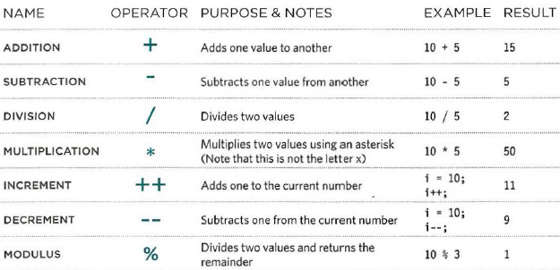

# Basics of HTML, CSS & JS

## Text

When creating a web page, you add tags (known as markup) to the contents of the page.
These tags provide extra meaning and allow browsers to show users the
appropriate structure for the page.

* Headings

HTML has six "levels" of headings:
`<h1>` is used for main headings `<h2>` is used for subheadings If there are further sections under the subheadings then the `<h3>` element is used, and so on.

* Paragraphs

A paragraph consists of one or more sentences that form a self-contained unit of discourse.
The start of a paragraph is indicated by a new line.

To create a paragraph, surround the words that make up the paragraph with an opening `
` tag and closing `
` tag.
By default, a browser will show each paragraph on a new line with some space between it and any subsequent paragraphs.

* Bold & Italic

By enclosing words in the tags `<b>` and `</b>` we can make characters appear bold.

By enclosing words in the tags `<i>` and `</i>` we can make characters appear italic.

* Line Breaks & Horizontal Rules

if you want to add a line break inside the middle of a paragraph you can
use the line break tag ` `.

To create a break between themes, you can add a horizontal rule between sections using the `
` tag.

* Strong and Emphasis

The use of the `<strong>` element indicates that its content has strong importance.
For example, the words contained in this element might be said with strong emphasis.

The `<em>` element indicates emphasis that subtly changes the meaning of a sentence.

## Introducing CSS

CSS allows you to create rules that specify how the content of an element should appear.
You can specify that the background of the page is cream, all paragraphs should appear in gray using the Arial typeface, or that all level one
headings should be in a blue, italic, Times typeface.

The key to understanding how CSS works is to imagine that there is an invisible box around every HTML element.

CSS works by associating rules with HTML elements.
These rules govern how the content of specified elements should be displayed.
A CSS rule contains two parts: a selector and a declaration.

### Inheritance

If you specify the font-family or color properties on the `<body>` element, they will apply to most child elements.
This is because the value of the font-family property is inherited by child elements.
It saves you from having to apply these properties to as many elements (and results in simpler style sheets).

CSS rules usually appear in a separate document, although they may appear within an HTML page.

## Basic JavaScript Instructions

### Statements

A script is a series of instructions that a computer can follow one-by-one.
Each individual instruction or step is known as a statement.
Statements should end with a semicolon.

### Comments

You should write comments to explain what your code does.
They help make your code easier to read and understand.
This can help you and others who read your code.

### Variables

A script will have to temporarily store the bits of information it needs to do its job. It can store this data in variables.

### Arrays

An array is a special type of variable. It doesn't just store one value; it stores a list of values.

### Arithmetic Operators

JavaScript contains the following mathematical operators, which you can use with numbers.

