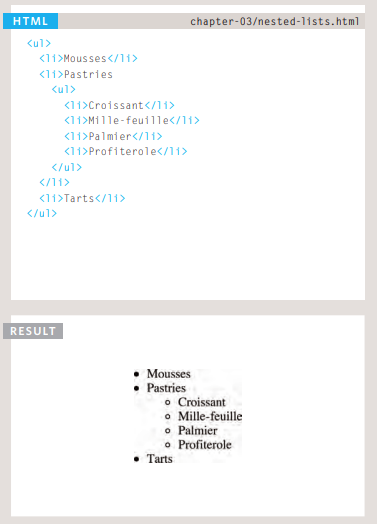

# HTML Lists, Control Flow with JS, and the CSS Box Model

## Lists

### Ordered Lists

The ordered list is created with
the `<ol>` element.

Each item in the list is placed
between an opening `<li>` tag
and a closing `</li>` tag. (The li
stands for list item.)

### Unordered Lists

The unordered list is created
with the `<ul>` element.

Each item in the list is placed
between an opening `<li>` tag
and a closing `</li>` tag. (The li
stands for list item.)

### Definition Lists

The definition list is created with
the `<dl>` element and usually
consists of a series of terms and
their definitions.
Inside the `<dl>` element you will
usually see pairs of `<dt>` and
`<dd>` elements.
`<dt>`
This is used to contain the term
being defined (the definition
term).
`<dd>`
This is used to contain the
definition.

### Nested Lists

You can put a second list inside
an `<li>` element to create a sublist or nested list

## Boxes

### Box Dimensions

By default a box is sized just big
enough to hold its contents. To
set your own dimensions for a
box you can use the height and
width properties.
The most popular ways to
specify the size of a box are
to use pixels, percentages, or
ems. Traditionally, pixels have
been the most popular method
because they allow designers to
accurately control their size.

### Limiting Width

Some page designs expand and
shrink to fit the size of the user's
screen. In such designs, the
min-width property specifies
the smallest size a box can be
displayed at when the browser
window is narrow, and the
max-width property indicates
the maximum width a box can
stretch to when the browser
window is wide.

### Limiting Height

In the same way that you might
want to limit the width of a box
on a page, you may also want
to limit the height of it. This is
achieved using the min-height
and max-height properties.

### Overflowing Content

The overflow property tells the
browser what to do if the content
contained within a box is larger
than the box itself. It can have
one of two value

* hidden

This property simply hides any
extra content that does not fit in
the box.

* scroll

This property adds a scrollbar to
the box so that users can scroll
to see the missing content.

### Border, Margin & Padding

Every box has three available properties that
can be adjusted to control its appearance:

1. Border
1. Margin
1. Padding

## Arrays

An array is a special type of variable. It doesn't
just store one value; it stores a list of values.

Values in an array are accessed as if they are in
a numbered list. It is important to know that the
numbering of this list starts at zero (not one).

## Decisions and Loops

Switch statements allow you to compare a value
against possible outcomes (and also provides a default
option if none match).

Data types can be coerced from one type to another.

All values evaluate to either truthy or falsy.

There are three types of loop: for, while, and
do ... while. Each repeats a set of statements.
