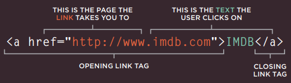
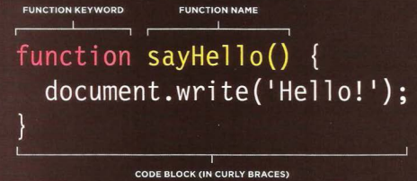

# HTML Links, JS Functions, and Intro to CSS Layout

## Links

Links are created using the `<a>` element. Users can click on anything
between the opening `<a>` tag and the closing `</a>` tag. You specify
which page you want to link to using the href attribute.

You can use the id attribute to target elements within
a page that can be linked to.

`<a href="http://www.imdb.com" target="_blank">`

### Email Links

* mailto:
To create a link that starts up
the user's email program and
addresses an email to a specified
email address, you use the `<a>`
element. However, this time the
value of the href attribute starts
with mailto: and is followed by
the email address you want the
email to be sent to.
`<a href="mailto:jon@example.org">Email Jon</a>`

## Layout

CSS treats each HTML element as if it is in its
own box. This box will either be a block-level
box or an inline box.

### Screen Sizes

Different visitors to your site will have different sized screens that show
different amounts of information, so your design needs to be able to
work on a range of different sized screens.

* `
` elements are often used as containing elements
to group together sections of a page.

* Browsers display pages in normal flow unless you
specify relative, absolute, or fixed positioning.

* The float property moves content to the left or right
of the page and can be used to create multi-column
layouts. (Floated items require a defined width.)

* Pages can be fixed width or liquid (stretchy) layouts.

* Designers keep pages within 960-1000 pixels wide,
and indicate what the site is about within the top 600
pixels (to demonstrate its relevance without scrolling).

* Grids help create professional and flexible designs.

* CSS Frameworks provide rules for common tasks.

* You can include multiple CSS files in one page.

## Functions, Methods, and Objects

### WHAT IS A FUNCTION?

Functions let you group a series of statements together to perform a
specific task. If different parts of a script repeat the same task, you can
reuse the function (rather than repeating the same set of statements). 

* Declaring a Function

* Calling a function

`sayHello();`

### VARIABLE SCOPE

The location where you declare a variable will affect where it can be used
within your code. If you declare it within a function, it can only be used
within that function. This is known as the variable's scope.

## 6 Reasons for Pair Programming

1. Greater efficiency
1. Engaged collaboration
1. Learning from fellow students
1. Social skills
1. Job interview readiness
1. Work environment readiness
