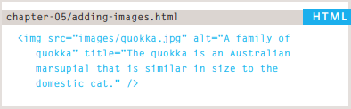

# HTML Images; CSS Color & Text

## Images

### Choosing Images for Your Site

A picture can say a thousand words, and great
images help make the difference between an
average-looking site and a really engaging one.

Images should...

 1. Be relevant
 1. Convey information
 1. Convey the right mood
 1. Be instantly recognisable
 1. Fit the color palette

### Adding Images

To add an image into the page
you need to use an ``
element. This is an empty
element (which means there is
no closing tag). It must carry the
following two attributes:

* src

This tells the browser where
it can find the image file. This
will usually be a relative URL
pointing to an image on your
own site. (Here you can see that
the images are in a child folder
called images).

* alt

This provides a text description
of the image which describes the
image if you cannot see it.

* title

You can also use the title
attribute with the `` element
to provide additional information
about the image. Most browsers
will display the content of this
attribute in a tootip when the
user hovers over the image.

### Three Rules for Creating Images

1. Save images in the right format
1. Save images at the right size
1. Use the correct resolution

## Color

The color property allows you
to specify the color of text inside
an element. You can specify any
color in CSS in one of three ways:

* rgb values

* hex codes

* color names

### Background Color

CSS treats each HTML element
as if it appears in a box, and the
background-color property
sets the color of the background
for that box.
You can specify your choice of
background color in the same
three ways you can specify
foreground colors: RGB values,
hex codes, and color names.
If you do not specify a
background color, then the
background is transparent.

## Text

### Typeface Terminology

 typefaces are subject to copyright, so the
techniques you can choose from are limited by their respective licenses.

### Specifying Typefaces

The font-family property
allows you to specify the
typeface that should be used for
any text inside the element(s) to
which a CSS rule applies.

### Size of Type

The font-size property enables
you to specify a size for the
font. There are several ways to
specify the size of a font.
