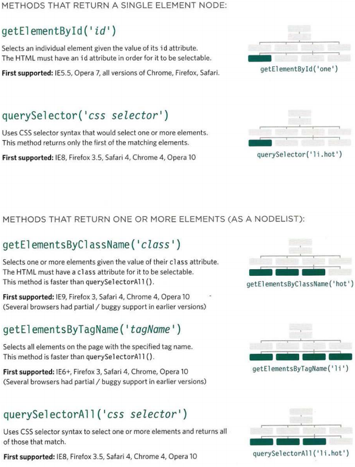

# Problem Domain, Objects, and the DOM

## The Problem Domain Is The Hardest Part Of Programming

Writing down the problem domain is similarly like building a puzzle without having a picture of how it should look like.

We put together code with the purpose of building components that we have taken out of the “bigger picture” of the problem domain.

The real world is a messy place.  Many of the problem domains we face as programmers are difficult to understand and look completely different depending on your viewpoint.

If understanding the problem domain is the hardest part of programming and you want to make programming easier, you can do one of two things:

1. Make the problem domain easier
1. Get better at understanding the problem domain

## WHAT IS AN OBJECT?

Objects group together a set of variables and functions to create a model
of a something you would recognize from the real world. In an object,
variables and functions take on new names.

## Document Object Model

As a browser loads a web page, it creates a model of that page.
The model is called a DOM tree, and it is stored in the browsers' memory.
It consists of four main types of nodes.

Each node is an object with methods and properties.
Scripts access and update this DOM tree (not the source HTML file).
Any changes made to the DOM tree are reflected in the browser. 

DOM queries may return one element, or they may return a Nodelist,
which is a collection of nodes. 

;

* The browser represents the page using a DOM tree.

* DOM trees have four types of nodes: document nodes,
element nodes, attribute nodes, and text nodes.

* You can select element nodes by their id or class
attributes, by tag name, or using CSS selector syntax.

* Whenever a DOM query can return more than one
node, it will always return a Nadelist.

* From an element node, you can access and update its
content using properties such as textContent and
i nnerHTML or using DOM manipulation techniques.

* An element node can contain multiple text nodes and
child elements that are siblings of each other.

* In older browsers, implementation of the DOM is
inconsistent (and is a popular reason for using jQuery).

* Browsers offer tools for viewing the DOM tree .
