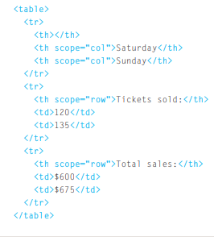
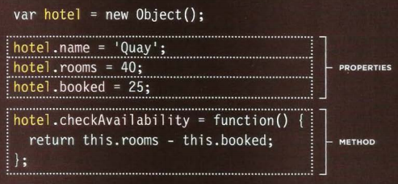

# Object-Oriented Programming, HTML Tables

## Domain Modeling

Domain modeling is the process of creating a conceptual model in code for a specific problem. A model describes the various entities, their attributes and behaviors, as well as the constraints that govern the problem domain. An entity that stores data in properties and encapsulates behaviors in methods is commonly referred to as an object-oriented model.

## HTML Tables

A table represents information in a grid format.
Examples of tables include financial reports, TV
schedules, and sports results.

### Table Structure

* You can make cells of a table span more than one row
or column using the rowspan and colspan attributes.

* For long tables you can split the table into a `<thead>`,
`<tbody>`, and `<tfoot>`.

## Functions, Methods, and Objects

The keyword this is commonly used inside functions and objects.
Where the function is declared alters what this means. It always refers
to one object, usually the object in which the function operates.

* Functions allow you to group a set of related
statements together that represent a single task.
* Functions can take parameters (informatiorJ required
to do their job) and may return a value.
* An object is a series of variables and functions that
represent something from the world around you.
* In an object, variables are known as properties of the
object; functions are known as methods of the object.
* Web browsers implement objects that represent both
the browser window and the document loaded into the
browser window.
* JavaScript also has several built-in objects such as
String, Number, Math, and Date. Their properties and
methods offer functionality that help you write scripts.
* Arrays and objects can be used to create complex data
sets (and both can contain the other). 