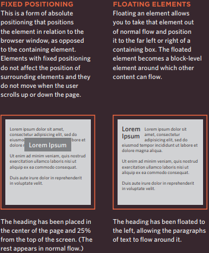

# CSS Layout

## Layout

CSS treats each HTML element as if it is in its
own box. This box will either be a block-level
box or an inline box.

## Controlling the Position of Elements

CSS has the following positioning schemes that allow you to control
the layout of a page: normal flow, relative positioning, and absolute
positioning. You specify the positioning scheme using the position
property in CSS. You can also float elements using the float property.

To indicate where a box should be positioned, you may also need to use
box offset properties to tell the browser how far from the top or bottom
and left or right it should be placed.

When you move any element from normal flow, boxes can overlap.
The z-index property allows you to control which box appears on top.

### Screen Sizes

Different visitors to your site will have different sized screens that show
different amounts of information, so your design needs to be able to
work on a range of different sized screens.

* `
` elements are often used as containing elements
to group together sections of a page.

* Browsers display pages in normal flow unless you
specify relative, absolute, or fixed positioning.

* The float property moves content to the left or right
of the page and can be used to create multi-column
layouts. (Floated items require a defined width.)

* Pages can be fixed width or liquid (stretchy) layouts.

* Designers keep pages within 960-1000 pixels wide,
and indicate what the site is about within the top 600
pixels (to demonstrate its relevance without scrolling).

* Grids help create professional and flexible designs.

* CSS Frameworks provide rules for common tasks.

* You can include multiple CSS files in one page.
