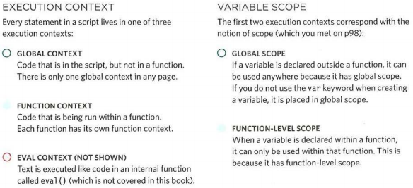
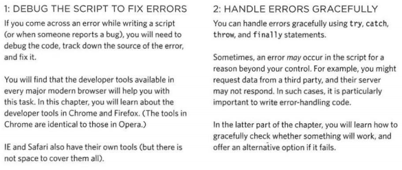

# Error Handling & Debugging

## ORDER OF EXECUTION

To find the source of an error, it helps to know how scripts are processed.
The order in which statements are executed can be complex; some tasks
cannot complete until another statement or function has been run.

## EXECUTION CONTEXTS

The JavaScript interpreter uses the concept of execution contexts.
There is one global execution context; plus, each function creates a new
new execution context. They correspond to variable scope.

## UNDERSTANDING SCOPE

In the interpreter, each execution context has its own va ri ables object.
It holds the variables, functions, and parameters available within it.
Each execution context can also access its parent's variables object.

## UNDERSTANDING ERRORS

If a JavaScript statement generates an error, then it throws an exception.
At that point, the interpreter stops and looks for exception-handling code.

## ERROR OBJECTS

Error objects can help you find where your mistakes are
and browsers have tools to help you read them.

## HOW TO DEAL WITH ERRORS

There are two things you can do with the errors.

## A DEBUGGING WORKFLOW

Debugging is about deduction: eliminating potential causes of an error.
Here is a workflow for techniques you will meet over the next 20 pages.
Try to narrow down where the problem might be, then look for clues.

* If you understand execution contexts (which have two
stages) and stacks, you are more likely to find the error
in your code.
* Debugging is the process of finding errors. It involves a
process of deduction.
* The console helps narrow down the area in which the
error is located, so you can try to find the exact error.
* JavaScript has 7 different types of errors. Each creates
its own error object, which can tell you its line number
and gives a description of the error.
* If you know that you may get an error, you can handle
it gracefully using the try, catch, finally statements.
Use them to give your users helpful feedback.
