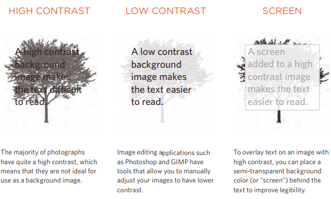

# Audio, Video, Images

## Images

### Image sizing and Alignment

You can control the size of the image using some css by adding width and height for the image.
Images can also be aligned in css by using  the float property.

The background-image property allows you to place an image behind any HTML element.
This could be the entire page or just part of the page. By default, a background image will repeat to fill the entire box.

### Repeating Images

* background-repeat

The background-repeat property can have four values:

  -repeat

  The background image is
repeated both horizontally and
vertically (the default way it
is shown if the backgroundrepeat property isn't used).

-repeat-x

The image is repeated
horizontally only (as shown in
the first example on the left).

-repeat-y

The image is repeated vertically
only.

-no-repeat

The image is only shown once.

* background-attachment

The background-attachment
property specifies whether a
background image should stay in
one position or move as the user
scrolls up and down the page. It
can have one of two values:

-fixed

The background image stays in
the same position on the page.

-scroll

The background image moves
up and down as the user scrolls
up and down the page.

### Background Position

When an image is not being repeated, you can use the background-position property to specify where in the browser window the background image should be placed.

### Contrast of background images

If you want to overlay text on a background image, the image must be low
contrast in order for the text to be legible.

## Practical Information

### Search Engine Optimization (SEO)

In every page of your website there are seven key places where keywords
(the words people might search on to find your site) can appear in order
to improve its findability.

* Page Title

The page title appears at the top
of the browser window or on the
tab of a browser. It is specified in
the `<title>` element which lives
inside the `<head>` element.

* URL / WEB Address

The name of the file is part of
the URL. Where possible, use
keywords in the file name.

* Headings

If the keywords are in a heading
`<hn>` element then a search
engine will know that this page is
all about that subject and give it
greater weight than other text.

* Text

Where possible, it helps to
repeat the keywords in the main
body of the text at least 2-3
times. Do not, however, over-use
these terms, because the text
must be easy for a human to
read

* Link Text

Use keywords in the text that
create links between pages
(rather than using generic
expressions such as "click here").

* Image Alt Text

Search engines rely on you
providing accurate descriptions
of images in the alt text. This
will also help your images show
up in the results of image-based
searches.

* Page Descriptions

The description also lives inside
the `<head>` element and is
specified using a `<meta>` tag.
It should be a sentence that
describes the content of the
page. (These are not shown in
the browser window but they
may be displayed in the results
pages of search engines.)

### Analytics: Learning about your Visitors

As soon as people start coming to your site, you can start analyzing
how they found it, what they were looking at and at what point they are
leaving. One of the best tools for doing this is a free service offered by
Google called Google Analytics.

* To put your site on the web, you will need to obtain a
domain name and web hosting.

* FTP programs allow you to transfer files from your
local computer to your web server.

* Many companies provide platforms for blogging, email
newsletters, e-commerce and other popular website
tools (to save you writing them from scratch).
