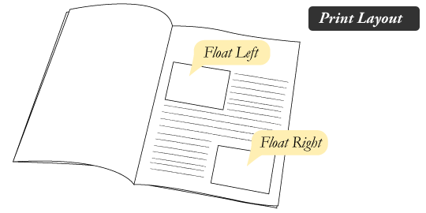
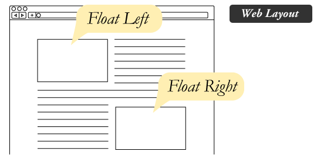

# RESPONSIVE WEB DESIGN and FLOATS

## Responsive Web Design

Responsive web design is the practice of building a website suitable to work on every device and every screen size, no matter how large or small, mobile or desktop. Responsive web design is focused around providing an intuitive and gratifying experience for everyone. Desktop computer and cell phone users alike all benefit from responsive websites.

Currently the most popular technique lies within responsive web design, favoring design that dynamically adapts to different browser and device viewports, changing layout and content along the way. This solution has the benefits of being all three, responsive, adaptive, and mobile.

## Flexible Layouts

flexible layouts, is the practice of building the layout of a website with a flexible grid, capable of dynamically resizing to any width. Flexible grids are built using relative length units, most commonly percentages or em units. These relative lengths are then used to declare common grid property values such as width, margin, or padding.

Flexible layouts do not advocate the use of fixed measurement units, such as pixels or inches. Reason being, the viewport height and width continually change from device to device. Website layouts need to adapt to this change and fixed values have too many constraints. Fortunately, Ethan pointed out an easy formula to help identify the proportions of a flexible layout using relative values.

## Media Queries

Media queries provide the ability to specify different styles for individual browser and device circumstances, the width of the viewport or device orientation for example. Being able to apply uniquely targeted styles opens up a world of opportunity and leverage to responsive web design.

### Logical Operators in Media Queries

Logical operators in media queries help build powerful expressions. There are three different logical operators available for use within media queries, including `and`, `not`, and `only`.

### Mobile First

One popular technique with using media queries is called mobile first. The mobile first approach includes using styles targeted at smaller viewports as the default styles for a website, then use media queries to add styles as the viewport grows.

The operating belief behind mobile first design is that a user on a mobile device, commonly using a smaller viewport, shouldn’t have to load the styles for a desktop computer only to have them over written with mobile styles later. Doing so is a waste of bandwidth. Bandwidth that is precious to any users looking for a snappy website.

## Floats

Float is a CSS positioning property. To understand its purpose and origin, we can look to print design. In a print layout, images may be set into the page such that text wraps around them as needed. This is commonly and appropriately called “text wrap”. Here is an example of that.

In page layout programs, the boxes that hold the text can be told to honor the text wrap, or to ignore it. Ignoring the text wrap will allow the words to flow right over the image like it wasn’t even there. This is the difference between that image being part of the flow of the page (or not). Web design is very similar.

In web design, page elements with the CSS `float` property applied to them are just like the images in the print layout where the text flows around them. Floated elements remain a part of the flow of the web page. This is distinctly different than page elements that use absolute positioning. Absolutely positioned page elements are removed from the flow of the webpage, like when the text box in the print layout was told to ignore the page wrap. Absolutely positioned page elements will not affect the position of other elements and other elements will not affect them, whether they touch each other or not.

### Values for Float

1. None (Default)
1. Right
1. Left
1. Inherit

Aside from the simple example of wrapping text around images, floats can be used to create entire web layouts.

### Clearing the Float

Float’s sister property is clear. An element that has the clear property set on it will not move up adjacent to the float like the float desires, but will move itself down past the float.

### Problems with Floats

Floats often get beat on for being fragile. The majority of this fragility comes from IE 6 and the slew of float-related bugs it has. As more and more designers are dropping support for IE 6, you may not care, but for the folks that do care here is a quick rundown.

1. Pushdown
1. Double Margin Bug
1. 3px Jog
1. Bottom Margin Bug
