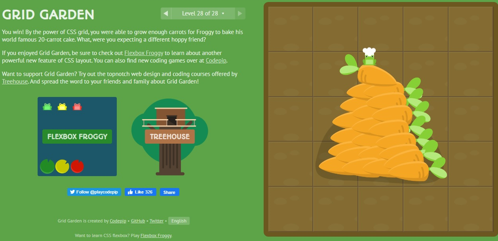

# CSS GRID

Method of using a grid concept to lay out content, providing a mechanism for developers to divide available space for layout into columns and rows using a set of sizing behaviors.

It's a CSS `display` property to let the browser give you a block-level box on the element and any direct children of the element will participate in a grid formatting context, so that they behave like grid items.

