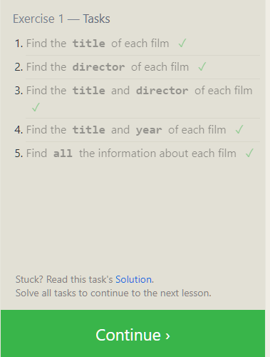
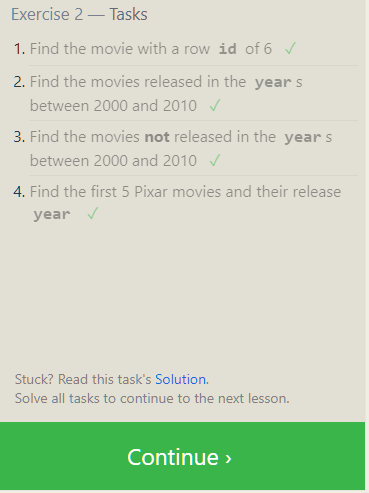
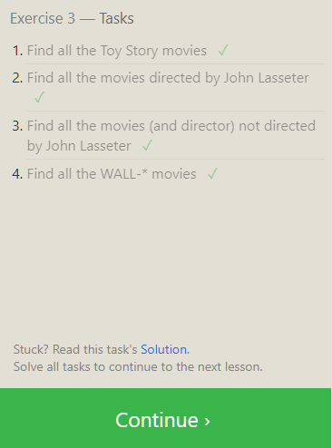
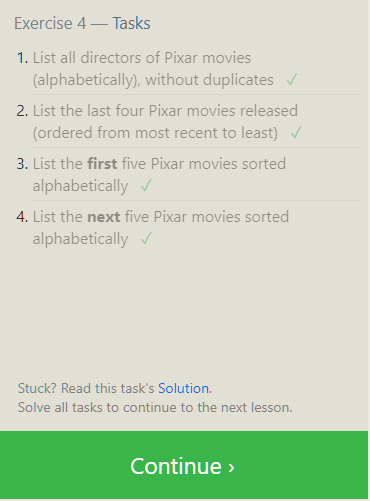
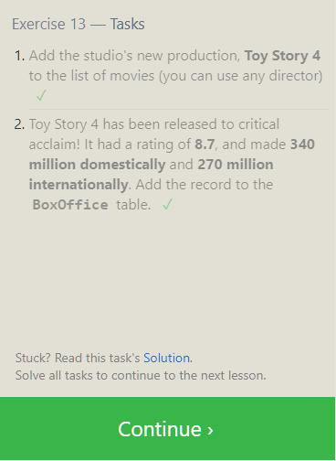
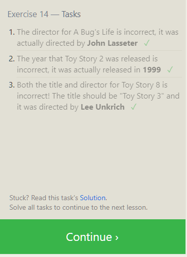
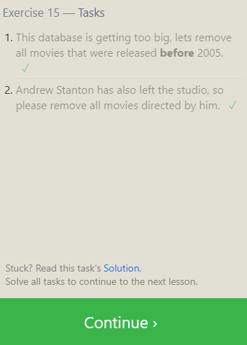
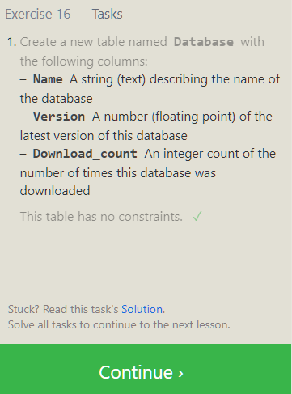
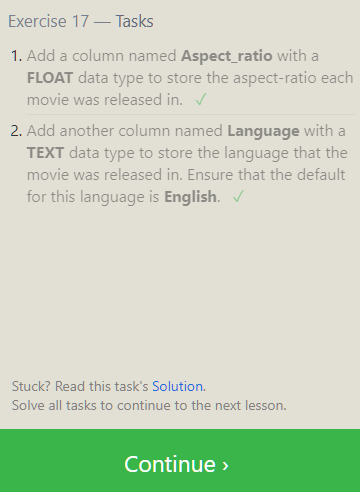
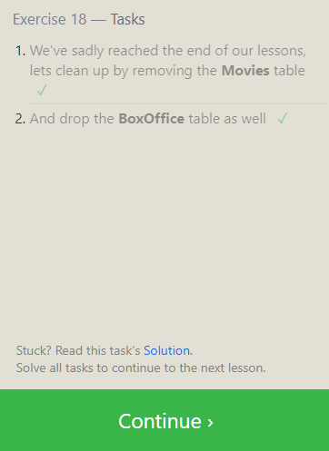

# SQL

SQL stands for Structured Query Language, and its a language designed to allow both technical and non-technical users query, manipulate, and transform data from a relational database. And due to its simplicity, SQL databases provide safe and scalable storage for millions of websites and mobile applications.

