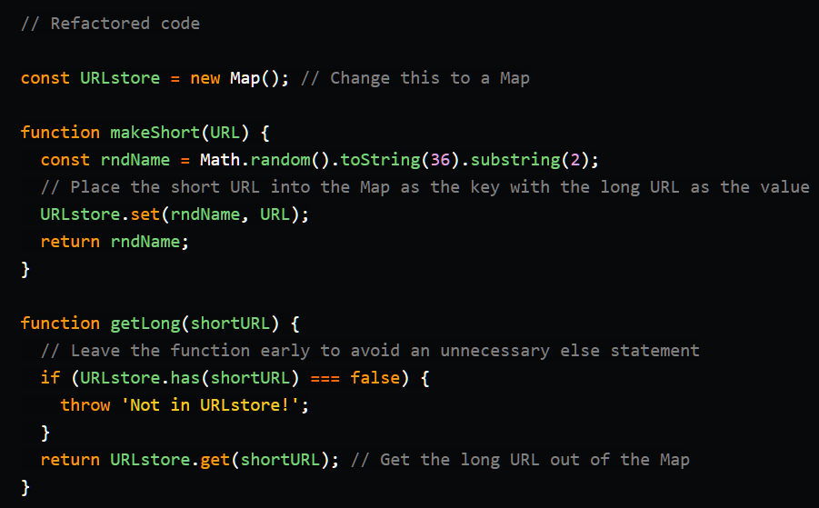

# Refactoring

## Concepts of Functional Programming in Javascript

its a programming pardigm and a style of building the structure and elements in our code.

### Pure Functions

In order for a fucntion to be pure, it must follow two things :

1. returning the same result if a function recived the same arguments
1. it doesnt cause any side effects.

your function must not use global elements in order to keep the rule of returning the same value for the same given arguments.

in case you have to use the global value inside of your function , you must send the global value as an argument to the function so that any changes happen to the global value, it will always return the same output for the givin inputs of a function.

examples of an impure functions are :

1. reading files function
1. random number generator functions

To follow the second rule of causing side effects..
your function should not change any of other global values

The benifets are a lot for making pure functions like they are easier to test since they always must return the same output for the same given input
not to mention that they are less complex and are re-usable !

## Refactoring JavaScript for Performance and Readability

in order to make your code readable with a better perfomance,
you should always follow some concepts to achive those things

example of these concepts are:

* always try to return from a function as soon as posible since your compiler wont have to go through each line of code in the function.

* Use some form of hash functions like Maps and Sets, they are used to map a given key to a location in the hash table.

an example of the use of map function

