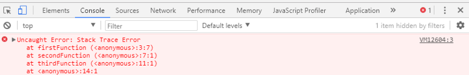

# The Call Stack and Debugging

## Call Stack

Whenever you call a function it will be added to the call stack until all of the lines of code of the function are executed, however, if call another function within a function, it will also be added to the call stack and the first function wont finish its block of codes until the last called function finishes its block of code.

a call stack is a data structure that uses the Last In, First Out (LIFO) principle to temporarily store and manage function invocation (call).

consider this code below

` function firstFunction(){  throw new Error('Stack Trace Error');} function secondFunction(){ firstFunction();} function thirdFunction(){ secondFunction();} thirdFunction(); `

notice that the firstFunction is at the top of the stack because as we mention the last function called will be the first to run

## Debugging and Errors

### Types of error messages

* Reference Errors

it happens when you try to add or pring a variable that is not declared

* Syntax Error

its like using or calling a function with some type which is gonna lead to a syntax error

* Range Error

usually the occue in arrays when you try to access an index that is not righ like a negative index or an index that is greater than the length of the array

* Type errors

trying to access a property/method thinking that a property is of the type object when in reality, since it hasn’t been declared yet, it’s undefined which doesn’t have any value available.

### Debugging

the most common and easiest way to debug your JS code is by using `console.log();`
as it will show where the code reached and what was the value at a certian point.
